# IoTEnterpriseApp


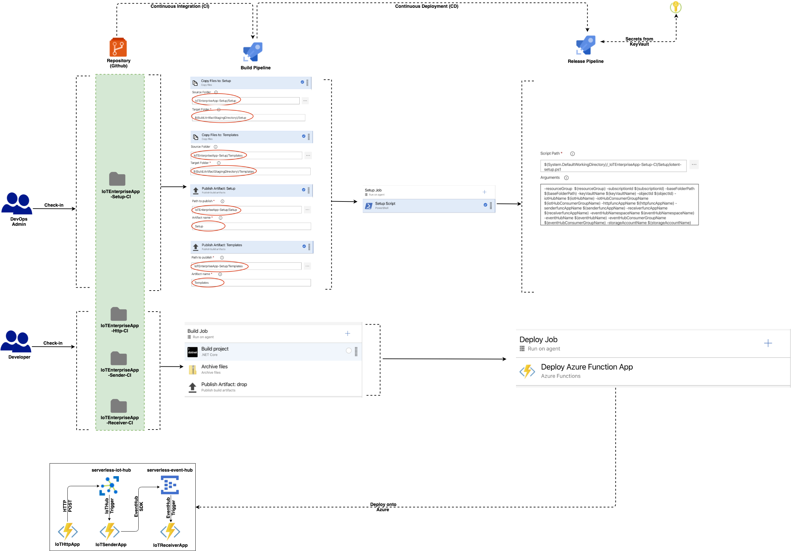

The purpose of this document is to showcase the power of IoTHub and Serverless technologies on Azure to help ingest high volume of data into various Analytics and Persistence resources on Azure. IoT being a popular and vast medium of data from different of devices across domains and industries, provides a rich data set to work on numerous other use cases using Azure Serverless, Event Messaging and Persistence frameworks.

We would discuss about a use case which involves - Azure Function and Azure EventHub - for Ingestion, Enriching and Processing the data from millions of IoT devices

The project folder structure is divided into 2 sections -

- **IoTEnterpriseApp**- Containing the source code of the entire flow
- **IoTEnterpriseApp-Setup** - This is IaaC or Infrastructure as Code to setup the entire process - end to end

Let us delve into each one of these one by one

## IoTEnterpriseApp-Http

### Http Trigger

```C#
[FunctionName("iotenthttp")]
public static async Task<IActionResult> Run(
    [HttpTrigger(AuthorizationLevel.Anonymous, "post", Route = null)] HttpRequest req,
    ILogger log)
{

    log.LogInformation("C# HTTP trigger function processed a request.");

    var deviceIdString = Environment.GetEnvironmentVariable("DEVICE_ID_1");
    if (req.Headers.ContainsKey("device-id"))
        deviceIdString = req.Headers["device-id"];

    string enterpriseIdString = string.Empty;
    if (req.Headers.ContainsKey("enterpriseid"))
        enterpriseIdString = req.Headers["enterpriseid"]; 

    string messageString = await new StreamReader(req.Body).ReadToEndAsync();
    log.LogInformation(messageString);

    if (kDeviceClient == null)
    {

        var deviceConnString = Environment.GetEnvironmentVariable("CONN_DEVICE_1");
        kDeviceClient = DeviceClient.CreateFromConnectionString(deviceConnString,
                                                                TransportType.Mqtt);
    }

    if (kDevicaeConnectionDictionary == null)
    {

        var deviceId1String = Environment.GetEnvironmentVariable("DEVICE_ID_1");
        kDeviceConnectionDictionary = new Dictionary<string, DeviceClient>()
        {

            [deviceId1String] = kDeviceClient                    
        };

    }

    var deviceClient = kDeviceConnectionDictionary[deviceIdString];
    await SendDeviceToCloudMessagesAsync(messageString, enterpriseIdString,
                                            deviceClient);

    log.LogInformation($"Done:{DateTime.Now.ToLongTimeString()}");
    return new OkObjectResult("OK-DONE");
}
```

This function acts on some Http POST request and sends data to an IoTHub

#### tmp.local.settings.json

```json
{
    "IsEncrypted": false,
    "Values": {
        "AzureWebJobsStorage": "<storage_account_key>",
        "FUNCTIONS_WORKER_RUNTIME": "dotnet",
        "DEVICE_ID_1": "<Device_ID>",
        "CONN_DEVICE_1": "<IoTHub_Conn>"
    }
}
```

This is to ensure that whoever checks out this code should know what value they need to add in Application settings in the portal. The original file *local.settings.json* **<u>should NOT be checked-in</u>** and kept in the local folder.

Shortly we would see how some of these values which are secured e.g. *CONN_DEVICE_1* will kept in KeyVault and referred by Azure DevOps during *Deployment* process - that way ADO becomes single source-of-truth for KeyVault taking away all complexities of KeyVault APIs and management

## IoTEnterpriseApp-Sender

### IoTHub Trigger

```C#
[FunctionName("iotentsender")]
public static async Task Run([IoTHubTrigger("messages/events", Connection = "IOT_HUB_CONN")]EventData message, ILogger log)
{
    log.LogInformation($"C# IoT Hub trigger function processed a message: {Encoding.UTF8.GetString(message.Body.Array)}");

    if (message.Properties.Keys.Contains("enterpriseid") == false)
        return;

    var connectionString = Environment.GetEnvironmentVariable("EVENT_HUB_CONN");
    var eventHubNameString = Environment.GetEnvironmentVariable("EVENT_HUB_NAME");

    if (eventProducer == null)
    {
        eventProducer = new EventHubProducerClient(connectionString);

    }

    foreach (var prop in message.Properties)
        log.LogInformation($"{prop.Key} - {prop.Value}");

    var partitionKeyString = message.Properties["enterpriseid"] as string;

    var batchOptions = new CreateBatchOptions()
    {

        PartitionKey = partitionKeyString

    };

    var eventDataBatch = await eventProducer.CreateBatchAsync(batchOptions);
    var partitionKeyName = Environment.GetEnvironmentVariable("PARTITION_KEY_NAME");

    var ed = new AZEH.EventData(message.Body);
    ed.Properties.Add(partitionKeyName, partitionKeyString);

    foreach (var prop in message.Properties)
        ed.Properties.Add(prop.Key, prop.Value);

    eventDataBatch.TryAdd(ed);

    await eventProducer.SendAsync(eventDataBatch);
}
```

This function is fired when data comes to IoTHub (*sent by the HttpTrigger function mentioned above*) and sends that to an EventHub.

For this POC, the function only extracts the value of the key ***enterpriseid***, which is custom field sent by the end user. Thsi field will be used as the PartitionKey for EventHub while sending data

#### tmp.local.settings.json

```json
{
    "IsEncrypted": false,
    "Values": {
        "AzureWebJobsStorage": "<storage_account_key>",
        "FUNCTIONS_WORKER_RUNTIME": "dotnet",
        "IOT_HUB_CONN": "<IOT_HUB_CONN>",
        "EVENT_HUB_CONN": "<EVENT_HUB_CONN>",
        "EVENT_HUB_NAME": "<EVENT_HUB_NAME>",
        "PARTITION_KEY_NAME": "<PARTITION_KEY_NAME>"
    }
}
```


## IoTEnterpriseApp-Receiver

### EventHub Trigger

```c#
[FunctionName("iotentreceiver")]
public static void Run([EventHubTrigger("srvlss-workshop-ehb",
                              Connection = "EVENT_HUB_CONN",
                              ConsumerGroup = "srvlss-workshop-enbcg")]
                              EventData[] events,                                      
                              ILogger log,
                              PartitionContext partitionContext)
{

    var partitionKeyName = Environment.GetEnvironmentVariable("PARTITION_KEY_NAME");
    foreach (EventData eventData in events)
    {

        var messageString = Encoding.UTF8.GetString(eventData.Body.ToArray());
        log.LogInformation($"Message:{messageString}");

        foreach (var prop in eventData.Properties)
            log.LogInformation($"Key:{prop.Key} - Value:{prop.Value}");

        if (eventData.Properties.ContainsKey(partitionKeyName) == true)
            log.LogInformation($"PartitionKey:{eventData.Properties[partitionKeyName]}");

    }            
}
```

This function is fired when data comes to EventHub (*sent by the IoTHubTrigger function mentioned above*). For this POC, the function only prints out the data coming to EventHub

#### tmp.local.settings.json

```json
{
    "IsEncrypted": false,
    "Values": {
        "AzureWebJobsStorage": "<storage_account_key>",
        "FUNCTIONS_WORKER_RUNTIME": "dotnet",        
        "EVENT_HUB_CONN": "<EVENT_HUB_CONN>",        
        "PARTITION_KEY_NAME": "<PARTITION_KEY_NAME>"
    }
}
```


## IoTEnterpriseApp-Setup

This folder contains files for setting up the entire infrastructure for this use case using *PowerShell* and *ARM templates*. Later on we would connect this with Azure DevOps (ADO) and bring in maximum automation.

As before let us see the folder structure and then subsequent details:

### Templates

#### iotent-keyvault-deploy.json

ARM template for creating/updating KeyVault which would be used for storing Secured Keys used by the Function app as explained above - primarily the keys which are mentioned in the *local.settings.json* file

#### iotent-keyvault-deploy.ps1

PowerShell script to execute the above ARM template

#### iotent-iothub-deploy.json

ARM template for creating/updating IoTHub and related resources

#### iotent-iothub-deploy.ps1

PowerShell script to execute the above ARM template. The output if this execution is a list of connection strings from IoTHub. This would be used by the Setup script to add these values to KeyVault. So, absolutely no manual access to these secured keys.

Please note that, Ideally IoTHub should be in ***S3 tier*** to support high throughput. Also, ideally IotHub should be created with maximum no. of partitions (*as this can not be changed later)* based on how many external systems is targeted...to get high parallelism

#### iotent-funcapp-deploy.json

ARM template for creating/updating Function App and related resources

#### iotent-funcapp-deploy.ps1

PowerShell script to execute the above ARM template.

All the functions should be in ***Premium Plan (EPx)*** as the use case would be to allow a data streams from IoTHub continuously and at high throughput rate

#### iotent-eventhub-deploy.json

ARM template for creating/updating EventHub and related resources

#### iotent-eventhub-deploy.ps1

PowerShell script to execute the above ARM template. The output if this execution is a list of connection strings from EventHub. This would be used by the Setup script to add these values to KeyVault. So, absolutely no manual access to these secured keys

### Setup

#### iotent-setup.ps1

PowerShell script for managing the entire setup process:

```powershell
param([Parameter(Mandatory=$false)] [string] $resourceGroup = "<resource_group>",
      [Parameter(Mandatory=$false)] [string] $subscriptionId = "<subscription_Id>",
      [Parameter(Mandatory=$false)] [string] $baseFolderPath = "<baseFolder_Path>",
      [Parameter(Mandatory=$false)] [string] $keyVaultName = "<keyVault_Name>",
      [Parameter(Mandatory=$false)] [string] $objectId = "<object_Id>",
      [Parameter(Mandatory=$false)] [string] $iotHubName = "<iotHub_Name>",
      [Parameter(Mandatory=$false)] [string] $iotHubConsumerGroupName = 
      "<iotHubConsumerGroup_Name>",
      [Parameter(Mandatory=$false)] [string] $httpfuncAppName = "<httpfuncApp_Name>",
      [Parameter(Mandatory=$false)] [string] $senderfuncAppName = "<senderfuncApp_Name>",
      [Parameter(Mandatory=$false)] [string] $receiverfuncAppName = "<receiverfuncApp_Name>",
      [Parameter(Mandatory=$false)] [string] $eventHubNamespaceName = 
      "<eventHubNamespace_Name>",
      [Parameter(Mandatory=$false)] [string] $eventHubName = "<eventHub_Name>",
      [Parameter(Mandatory=$false)] [string] $eventHubConsumerGroupName = 
      "<eventHubConsumerGroup_Name>",
      [Parameter(Mandatory=$false)] [string] $storageAccountName = "<storageAccount_Name>")

$templatesFolderPath = $baseFolderPath + "/Templates"
$keyvaultDeployCommand = "/iotent-keyvault-deploy.ps1 -rg $resourceGroup -fpath $templatesFolderPath -keyVaultName $keyVaultName -objectId $objectId"
$iotHubDeployCommand = "/iotent-iothub-deploy.ps1 -rg $resourceGroup -fpath $templatesFolderPath -iotHubName $iotHubName -iotHubConsumerGroupName $iotHubConsumerGroupName"
$functionDeployCommand = "/iotent-funcapp-deploy.ps1 -rg $resourceGroup -fpath $templatesFolderPath -httpfuncAppName $httpfuncAppName -senderfuncAppName $senderfuncAppName -receiverfuncAppName $receiverfuncAppName -storageAccountName $storageAccountName"
$eventHubDeployCommand = "/iotent-eventhub-deploy.ps1 -rg $resourceGroup -fpath $templatesFolderPath -eventHubNamespaceName $eventHubNamespaceName -eventHubName $eventHubName -eventHubConsumerGroupName $eventHubConsumerGroupName"

# # PS Logout
# Disconnect-AzAccount

# # PS Login
# Connect-AzAccount

# PS Select Subscriotion 
Select-AzSubscription -SubscriptionId $subscriptionId

#  KeyVault deploy
$keyvaultDeployPath = $templatesFolderPath + $keyvaultDeployCommand
Invoke-Expression -Command $keyvaultDeployPath

#Keys List for holding various Keys...to be dsaved in KeyVault
$keysList = New-Object -TypeName System.Collections.ArrayList

#  IoTHub deploy
$iotHubDeployPath = $templatesFolderPath + $iotHubDeployCommand
$iotHubOutput = Invoke-Expression -Command $iotHubDeployPath

# Get IotHub Keys
$outputKeys = $iotHubOutput[1].Outputs.Keys

# Get IotHub Values
$outputValues = $iotHubOutput[1].Outputs.Values

foreach ($item in $outputKeys)
{
      $keysList.Add($item)
}

$index = 0;
foreach ($item in $outputValues)
{
      
      $iotHubConnectionKey = $keysList[$index]
      $iotHubConnectionString = $item.Value

      $iotHubConnectionKeyObject = ConvertTo-SecureString `
      -String $iotHubConnectionString -AsPlainText -Force

      # Save into KeyVault
      Set-AzKeyVaultSecret -VaultName $keyVaultName -Name $iotHubConnectionKey `
      -SecretValue $iotHubConnectionKeyObject

      ++$index
}

# Clean up KeysList..to be used later
$keysList.Clear();

#  Function Apps deploy
$functionDeployPath = $templatesFolderPath + $functionDeployCommand
Invoke-Expression -Command $functionDeployPath

#  Event Hub deploy
$eventHubDeployPath = $templatesFolderPath + $eventHubDeployCommand
Invoke-Expression -Command $eventHubDeployPath
$eventHubOutput = Invoke-Expression -Command $eventHubDeployPath

# Get EventHub Keys
$outputKeys = $eventHubOutput[1].Outputs.Keys

# Get EventHub Values
$outputValues = $eventHubOutput[1].Outputs.Values

foreach ($item in $outputKeys)
{
      $keysList.Add($item)
}

$index = 0;
foreach ($item in $outputValues)
{
      
      $eventHubConnectionKey = $keysList[$index]
      $eventHubConnectionString = $item.Value

      $eventHubonnectionKeyObject = ConvertTo-SecureString `
      -String $eventHubConnectionString -AsPlainText -Force

      Set-AzKeyVaultSecret -VaultName $keyVaultName -Name $eventHubConnectionKey `
      -SecretValue $eventHubonnectionKeyObject

      ++$index
}

# Clean up KeysList
$keysList.Clear();

Write-Host "Setup All Done"
```


## Integration with DevOps

### Users

Primariy two sets of users - 

* **DevOps Admin** - Can access only the ***IoTEnterpriseApp-Setup*** folder; so can setup the environment
* **Developer** - Can access only the ***IoTEnterpriseApp*** folder i.e. Application folder; can only deploy application code. ***No access to or knowledge of*** the setup process of entire infrastructure

### CI Pipelines

#### IoTEnterpriseApp-Setup

##### Copy Files: Setup

##### 

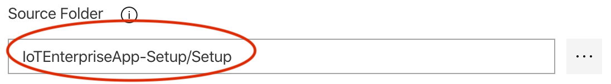

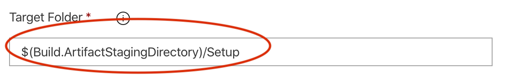


##### Publish Artifact: Setup


As you can see, the Publish location of the Build artifact is **Setup** folder in this case...so all PowerShell script and JSON templates will be copied and published in the said folder. *CD* pipeline would pickup the artifact from the **Setup** folder and act accordingly

##### Copy Files: Templates


##### Publish Artifact: Templates


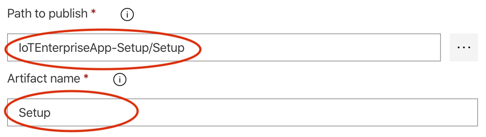

As you can see, the Publish location of the Build artifact is **Templates** folder in this case...so all PowerShell script and JSON templates will be copied and published in the said folder. *CD* pipeline would pickup the artifact from the **Templates** folder and act accordingly

##### Trigger

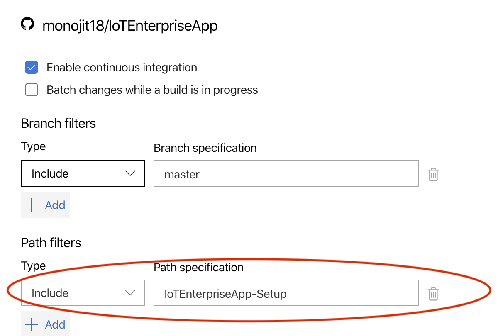

Please look at the *Path filters* section - *IoTEnterpriseApp-Setup* is the folder name; any changes in this folder only will trigger this *Setup* pipeline. So, both application developers and DevOps admin can peacefully work on their respective flows with minimal impact on each other!


#### IoTEnterpriseApp-Http

#### IoTEnterpriseApp-Sender

#### IoTEnterpriseApp-Receiver

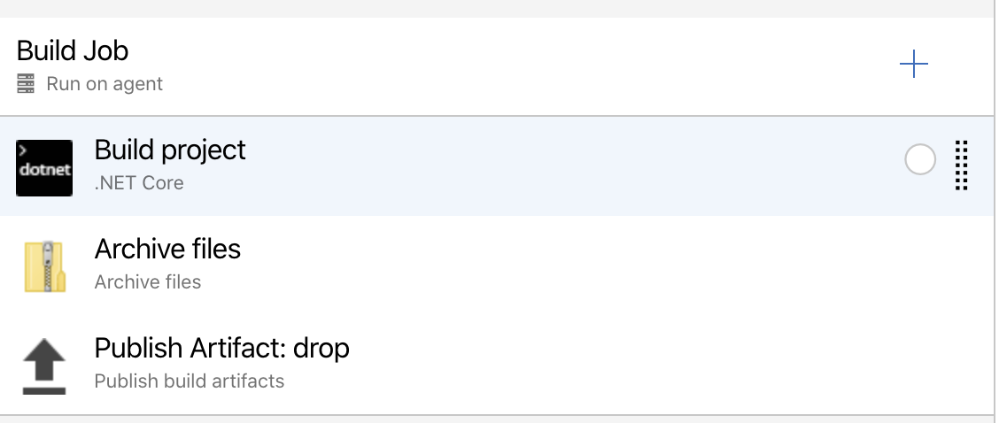

As mentioned earlier, only Developers should have access to it which would build the Application code. All the 3 applications have the same CI pipeline job as these are Azure functions with different purposes only


##### Trigger

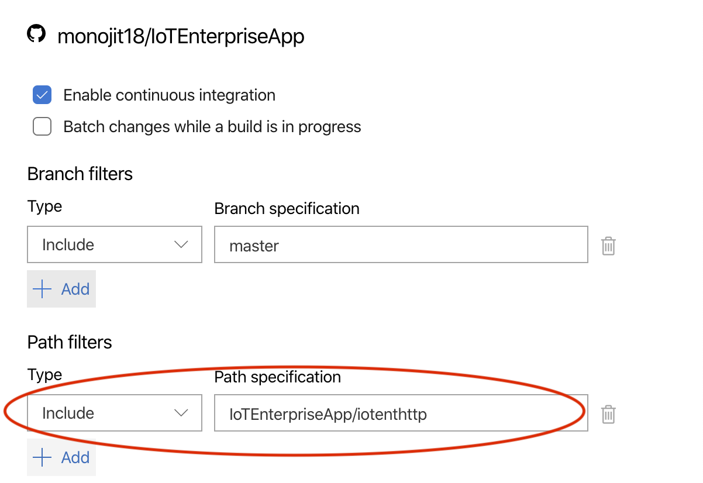

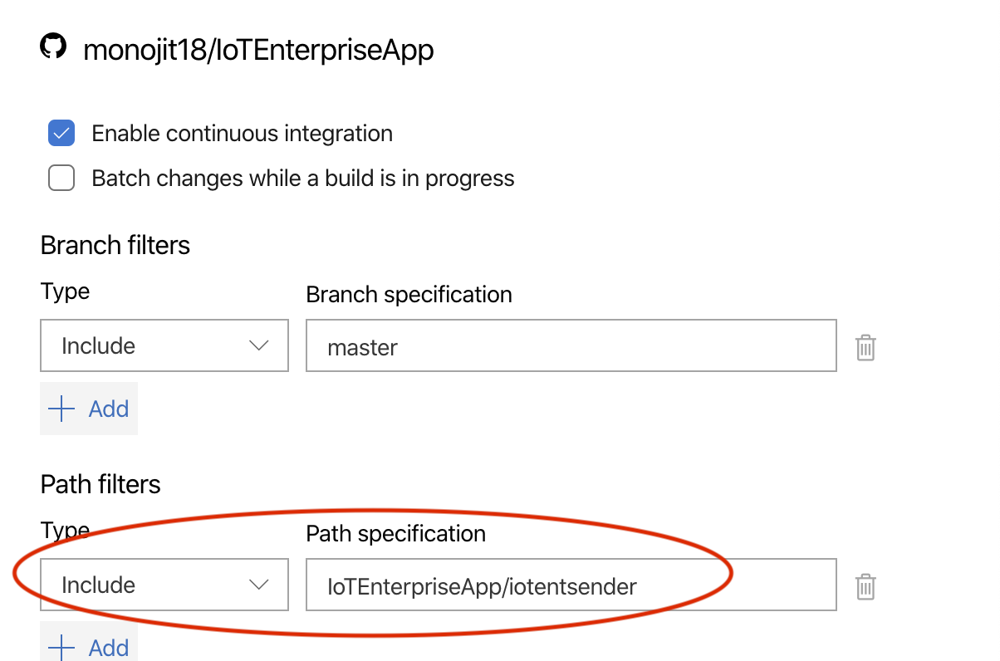

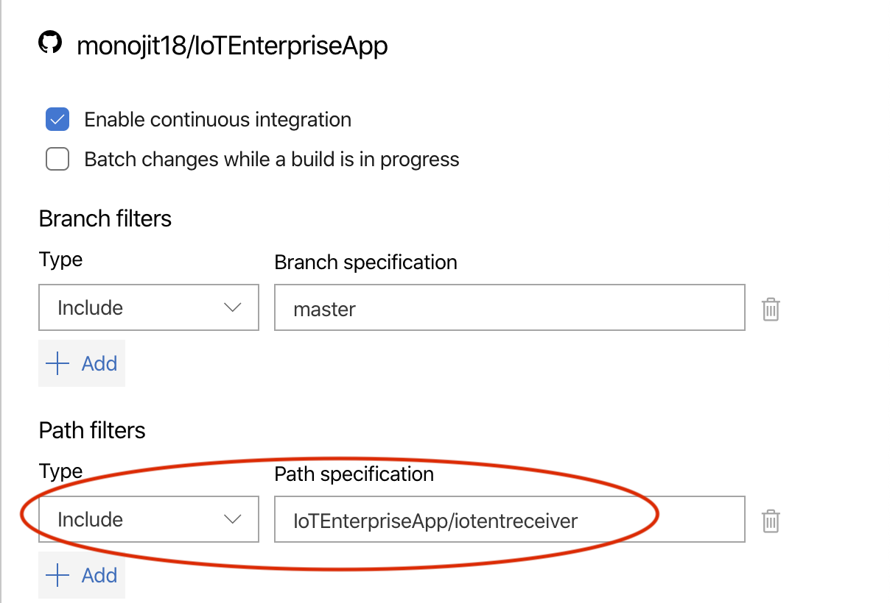

Please look at the *Path filters* section - *IoTEnterpriseApp* is the folder name; any changes in this folder only will trigger this *Application Deployment* pipeline. So, both application developers and DevOps admin can peacefully work on their respective flows with minimal impact on each other!


### CD Pipelines

#### IoTEnterpriseApp-Setup

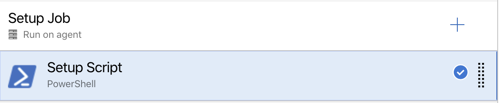

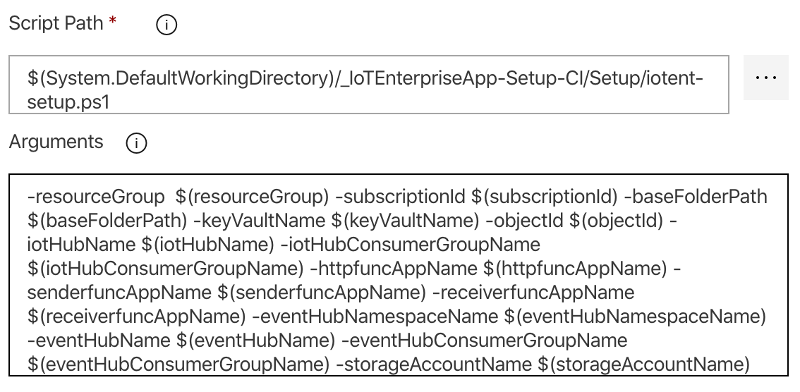


#### Pipeline Variables

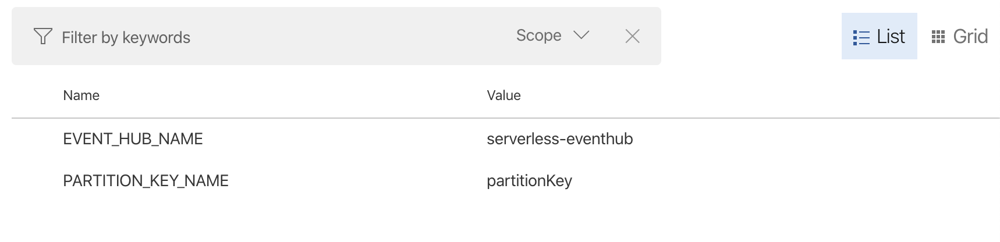

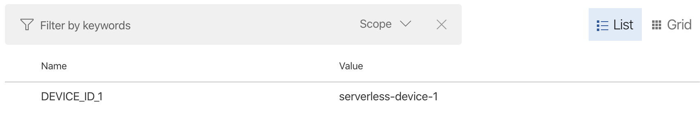

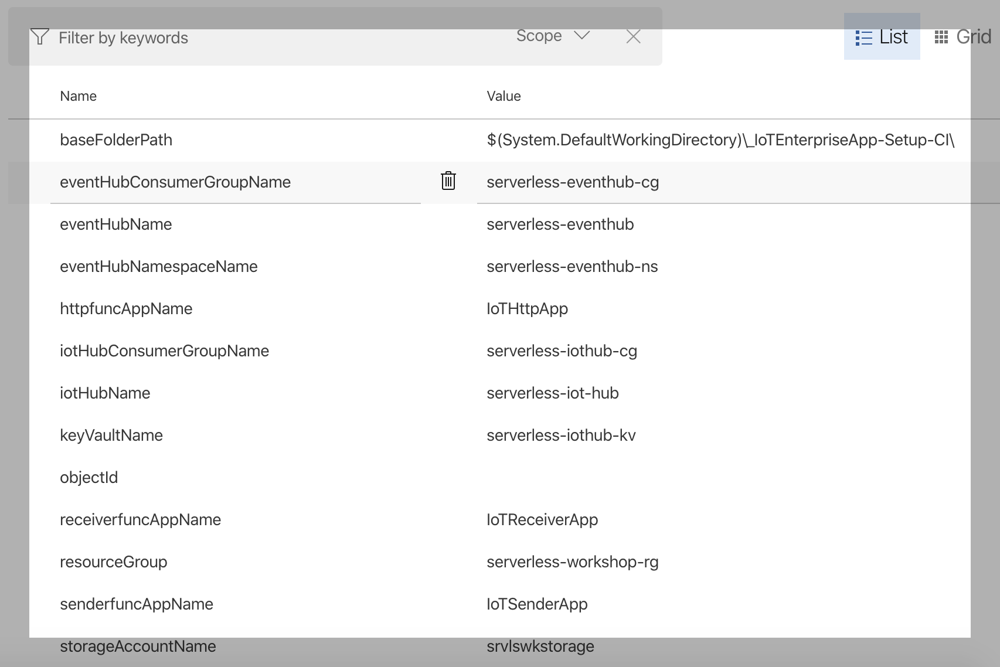

These are variables for each CD Pipeline used by PowerShell scripts as described above.

#### Variable Groups

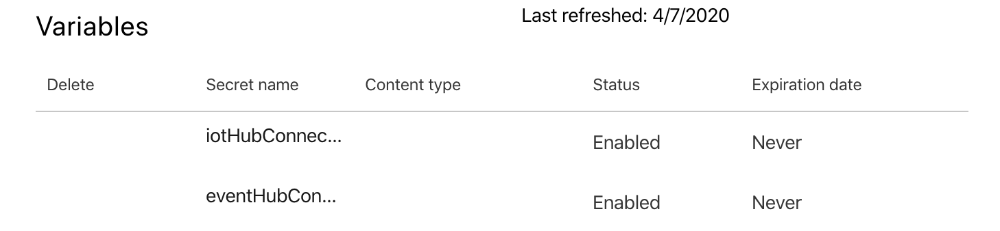

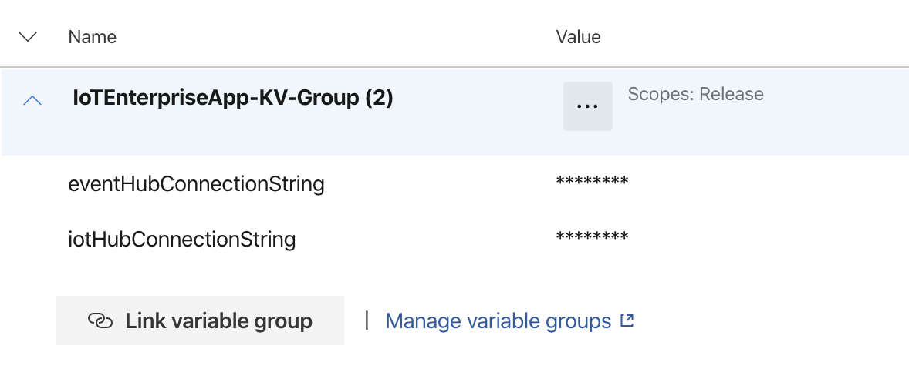

Secured values are automatically downloaded by ADO before initiating any of the tasks. So, you need to create a *Variable Group* in *Library* section. And then link that Variable G*roup* to *Pipeline Variables* section as shown above


#### IoTEnterpriseApp-Http

#### IoTEnterpriseApp-Sender

#### IoTEnterpriseApp-Receiver

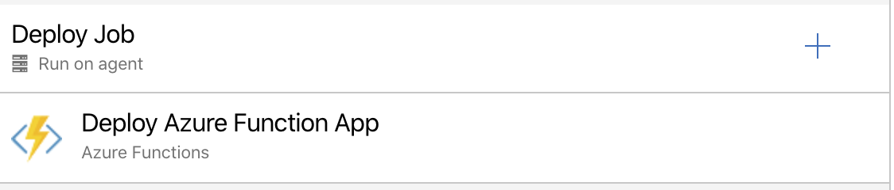

Application Deployment step and only one task - *Deploy Azure Function App*. All the 3 applications have the same CD pipeline job as these are Azure functions with different purposes only

=================================X======================================